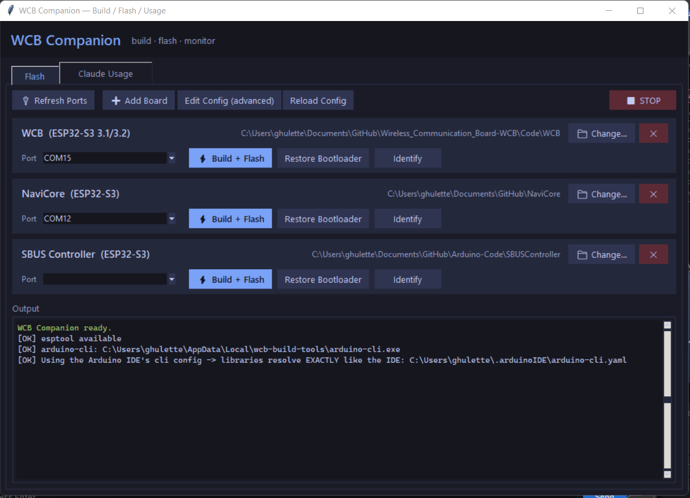

# ESP Flasher Companion

A one-window desktop app for building and flashing **multiple ESP32 / ESP32-S3
Arduino projects** — no Arduino IDE round-trips, no command lines, no hunting
through file explorer for the right script.

Built with plain Python + tkinter (**no GUI-framework dependencies**), and it
ships as a **standalone executable** so end users need nothing installed — not
even Python.



## What it does

- **A card per project/board.** Each card has its own remembered serial port —
  with several boards connected you set each port once and just push buttons,
  no switching a shared dropdown.
- **⚡ Build + Flash** — compiles the sketch with `arduino-cli` (verbose,
  IDE-style output streaming live) and flashes **only the app** at `0x10000`,
  leaving the bootloader, partition table, and NVS (saved settings) untouched.
- **Restore Bootloader** — re-flashes a custom bootloader at `0x0` *after* an
  Arduino IDE upload (the IDE overwrites the bootloader every time). **Guarded**:
  it reads the chip type and the flash chip's real size first and refuses to
  flash on any mismatch — a bootloader built for the wrong flash size silently
  corrupts NVS (settings stop persisting), so the guard makes that impossible.
- **Identify** — chip type, real flash size, PSRAM, MAC for whatever is on the
  selected port.
- **➕ Add Board / ✕ Remove / 📁 Change…** — manage projects entirely from the
  UI. Adding a board is: pick the sketch folder, tick the USB-CDC / OPI-PSRAM
  boxes if the project needs them, done. Everything persists in a JSON config.
- **Claude Usage tab** — if you use [Claude Code](https://claude.com/claude-code),
  shows your last 7 days of token usage per model, parsed from local session
  logs (exact token counts + rough cost estimate).

## Project layout

```
ESP-Flasher-Companion/
├── src/
│   └── esp_flasher_companion.py     ← the whole app (one file)
├── scripts/
│   ├── run-windows.bat              ← run from source (needs Python)
│   ├── run-macos.command           ← run from source (needs Python)
│   ├── build-windows.bat           ← build the standalone .exe
│   └── build-macos.command         ← build the standalone .app
├── .github/workflows/build.yml     ← CI: builds Windows + macOS automatically
├── screenshot.png
├── README.md
└── LICENSE
```

The per-machine config (`esp_flasher_config.json`) and PyInstaller's `build/`
and `dist/` output folders are generated at runtime and are gitignored.

## Getting it

There are two ways to run the app. Most users want **Option A**.

### Option A — Standalone executable (no Python needed)

Grab a prebuilt binary from the project's **Releases** (or from a CI run's
artifacts), then:

- **Windows:** double-click `ESP-Flasher-Companion.exe`.
- **macOS:** unzip, then **right-click → Open** the first time (the app is
  unsigned, so Gatekeeper needs the one-time override; afterwards a normal
  double-click works).

That single file bundles Python, tkinter, pyserial, and esptool. Nothing to
install. See [Building standalone executables](#building-standalone-executables)
to produce one yourself.

> You still need **arduino-cli** (and the ESP32 core) for the **Build + Flash**
> button — see Requirements. Identify / Restore Bootloader / Claude Usage all
> work with just the executable.

### Option B — Run from source (developers)

Needs Python 3.8+ and `pip install pyserial esptool`, then:

- **Windows:** double-click `scripts\run-windows.bat`
- **macOS:** `chmod +x scripts/run-macos.command` once, then double-click
- or directly: `python src/esp_flasher_companion.py`

## Requirements

| For…                                   | You need                                            |
| -------------------------------------- | --------------------------------------------------- |
| Running the **standalone executable**  | Nothing (Python + deps are bundled)                 |
| Running **from source**                | Python 3.8+ · `pip install pyserial esptool`        |
| The **Build + Flash** button (either)  | `arduino-cli` on PATH, with your ESP32 core installed |

`arduino-cli` is found on PATH, or via a local copy in
`%LOCALAPPDATA%\wcb-build-tools\arduino-cli.exe`.

## The key trick: libraries resolve exactly like the IDE

The app runs `arduino-cli` with **the Arduino IDE's own config file**
(`~/.arduinoIDE/arduino-cli.yaml`), so the sketchbook and libraries resolve
*identically* to the IDE. If a sketch builds in your IDE, it builds here — no
duplicate library installs, no version drift.

## Building standalone executables

The app is packaged with [PyInstaller](https://pyinstaller.org/) into a single
executable that bundles Python + every dependency.

### How it works

- **esptool runs in-process.** A frozen build has no `python.exe` to spawn, so
  `python -m esptool` is impossible — instead the app calls `esptool.main()`
  directly and streams its output into the log. esptool's chip **flasher stubs**
  are bundled via `--collect-all esptool`.
- **Config lives next to the executable.** When frozen, the app anchors its
  paths to the executable (not the temp unpack dir), so
  `esp_flasher_config.json` persists between runs. Keep the `.exe`/`.app` in a
  normal folder you can write to (not `C:\Program Files`).
- **A `--selftest` flag** (used by the build scripts and CI) confirms esptool,
  its stubs, and pyserial are bundled and that esptool runs in-process — it
  exits non-zero if anything is missing, so a broken build fails loudly.

### Build it on your own machine

> **PyInstaller cannot cross-compile.** A Windows `.exe` must be built on
> Windows; a macOS `.app` must be built on a Mac. There is no way around this —
> use CI (below) if you only have one OS.

- **Windows:** double-click `scripts\build-windows.bat`
  → `dist\ESP-Flasher-Companion.exe`
- **macOS:** `chmod +x scripts/build-macos.command` once, then double-click
  → `dist/ESP Flasher Companion.app`

Each script installs PyInstaller if needed, builds, runs the `--selftest`, and
tells you where the result is.

### Or let CI build both

[`.github/workflows/build.yml`](.github/workflows/build.yml) builds the Windows
`.exe` **and** the macOS `.app` on GitHub's runners — the easiest way to get a
Mac build when you only have a Windows machine (or vice versa).

- **On demand:** Actions tab → *Build standalone executables* → **Run workflow**.
  The binaries are attached to the run as artifacts.
- **On release:** push a `v*` tag (e.g. `git tag v1.0 && git push --tags`) and
  the workflow also publishes both binaries to a GitHub Release.

## First run & config

On first launch the app creates `esp_flasher_config.json` next to itself
(auto-detecting known sibling projects if it finds them). All paths, boards, and
remembered ports live there; it's gitignored because it's per-machine. Use the
in-app **➕ Add Board / Edit Config** buttons, or delete the file to regenerate
fresh defaults.

## FQBN gotchas (read this if a board misbehaves after flashing)

A target's `fqbn` must mirror **every non-default setting in the IDE's Tools
menu** for that sketch, not just the board name. Two real-world examples that
cost us debugging time:

- A project using the S3's **native USB** for serial needs
  `USBMode=hwcdc,CDCOnBoot=cdc` — without it, `Serial` goes to UART pins and
  the board looks dead on USB.
- A project allocating big buffers in **PSRAM** needs `PSRAM=opi` (or `enabled`
  for quad) — without it `ps_malloc/ps_calloc` return null.

The ➕ Add Board dialog has checkboxes for both.

## Custom bootloader notes

The "Restore Bootloader" button exists because the Arduino IDE rewrites
address `0x0` on every upload, wiping any custom bootloader (e.g. one with a
shortened RTC watchdog for cold-boot auto-recovery). Point each target's
`bootloader` config entry at your `.bin`; `expect_chip` / `expect_size` are the
guard values — they must match the board's real chip + flash size.

**Hard-won warning:** a bootloader whose header declares the wrong flash size
(e.g. 4MB on a 16MB chip) will appear to work — the app boots — but runtime
NVS reads silently fail and *no setting ever persists across reboot*. Build
custom bootloaders from your Arduino core's own sdkconfig and verify with
`esptool image-info` before deploying.

## License

MIT — see [LICENSE](LICENSE).
